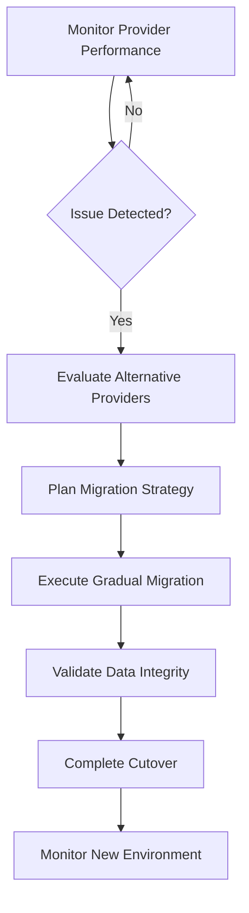

# Storage

Outrun's storage architecture is designed for maximum reliability, performance, and compliance. Our multi-region infrastructure ensures your data is always available while meeting local data sovereignty requirements.

<div class="bg-blue-500 bg-opacity-10 border border-blue-500 rounded-lg p-6 my-6">
  <h3 class="text-blue-400 text-lg font-semibold mb-3">🌍 Global Infrastructure</h3>
  <p class="text-gray-300">Your data is automatically replicated across multiple data centers in your chosen region, with intelligent placement based on user location for optimal compliance and performance.</p>
</div>

## Multi-Region Architecture

### High Availability Design
Every piece of data is stored with built-in redundancy:

- **Primary Dataset**: Your main operational data
- **2 Replicas**: Automatic replication across logically separate data centers
- **3 Data Centers Minimum**: Always distributed across at least 3 facilities
- **Real-time Synchronization**: Changes replicated immediately across all locations

### Regional Data Centers

<div class="grid grid-cols-1 md:grid-cols-3 gap-6 my-8">
  <div class="bg-dark-light border border-green-500 rounded-lg p-6">
    <h3 class="text-green-400 text-lg font-semibold mb-3">🇦🇺 Australia</h3>
    <ul class="text-gray-300 space-y-2 text-sm">
      <li>• <strong>NextDC S1</strong><br/>Sydney, New South Wales</li>
      <li>• <strong>NextDC M2</strong><br/>Melbourne, Victoria</li>
      <li>• <strong>NextDC P1</strong><br/>Perth, Western Australia</li>
    </ul>
    <p class="text-gray-400 text-xs mt-3">Tier III+ facilities with 99.999% uptime SLA</p>
  </div>

  <div class="bg-dark-light border border-blue-500 rounded-lg p-6">
    <h3 class="text-blue-400 text-lg font-semibold mb-3">🇪🇺 Europe</h3>
    <ul class="text-gray-300 space-y-2 text-sm">
      <li>• <strong>Hetzner Nuremberg</strong><br/>Data Center Park, Germany</li>
      <li>• <strong>Hetzner Falkenstein</strong><br/>Data Center Park, Germany</li>
      <li>• <strong>Hetzner Helsinki</strong><br/>Data Center Park, Finland</li>
    </ul>
    <p class="text-gray-400 text-xs mt-3">GDPR-compliant facilities with renewable energy</p>
  </div>

  <div class="bg-dark-light border border-purple-500 rounded-lg p-6">
    <h3 class="text-purple-400 text-lg font-semibold mb-3">🇺🇸 United States</h3>
    <ul class="text-gray-300 space-y-2 text-sm">
      <li>• <strong>DigitalOcean NYC3</strong><br/>New York City</li>
      <li>• <strong>DigitalOcean SFC3</strong><br/>San Francisco</li>
      <li>• <strong>DigitalOcean NYC1</strong><br/>New York City</li>
    </ul>
    <p class="text-gray-400 text-xs mt-3">SOC 2 Type II certified infrastructure</p>
  </div>
</div>

## Intelligent Regional Placement

### Automatic User-Based Placement
Rather than storing all data in a single region, Outrun intelligently places data based on user location:

```json
// Example: Multi-region data placement
{
  "workspace": "acme-corp",
  "users": [
    {
      "email": "john@acme.com",
      "location": "United States",
      "dataRegion": "US",
      "primaryDC": "NYC3",
      "replicas": ["SFC3", "NYC1"]
    },
    {
      "email": "sarah@acme.com.au", 
      "location": "Australia",
      "dataRegion": "AU",
      "primaryDC": "S1-Sydney",
      "replicas": ["M2-Melbourne", "P1-Perth"]
    }
  ]
}
```

### Benefits of Regional Placement
- **Compliance**: Automatic adherence to local data sovereignty laws
- **Performance**: Reduced latency for users in their home region
- **Single Interface**: One unified platform regardless of data location
- **Regulatory Flexibility**: Meet multiple jurisdictions without separate instances

### Location Detection Methods
Outrun determines user regions through multiple data sources:

1. **CRM Location Fields**: User-provided location data in your systems
2. **Email Domain Analysis**: Geographic indicators from email addresses
3. **IP Geolocation**: Fallback method for user session data
4. **Manual Override**: Explicit region selection when needed

## Infrastructure Management

### Containerized Applications
Our applications are fully containerized for maximum flexibility:

- **Multi-Cloud Deployment**: Workloads distributed across providers
- **Load Balancing**: Automatic traffic distribution
- **Failover Capability**: Seamless switching between providers
- **Scaling**: Dynamic resource allocation based on demand

### Provider Independence
We avoid hyperscaler lock-in for strategic reasons:

#### Why We Avoid Hyperscalers
- **Cost Efficiency**: Better value from specialized providers
- **Technology Freedom**: No vendor lock-in prevents innovation constraints
- **Competitive Pricing**: Leverage competition between providers
- **Service Quality**: Focus on providers who excel in specific regions

#### Regional Provider Strategy
- **Local Expertise**: Partners domiciled in each region
- **Regulatory Alignment**: Providers familiar with local compliance requirements
- **Cultural Understanding**: Better support for regional business practices
- **Economic Benefits**: Supporting local technology ecosystems

### Infrastructure Flexibility

#### Provider Migration Capability
We maintain the ability to move between providers when necessary:

- **Infrastructure Outages**: Rapid recovery from provider issues
- **Service Improvements**: Migration to better performing providers
- **Risk Reduction**: Diversification across multiple infrastructure partners
- **Cost Optimization**: Taking advantage of competitive pricing

#### Migration Process


## Data Storage Architecture

### Logical Database Separation
Each workspace maintains complete data isolation:

- **Workspace ID**: Unique identifier for data segregation
- **Logical Databases**: Separate database instances per workspace
- **Access Controls**: Strict permissions based on workspace membership
- **Data Boundaries**: No cross-workspace data access

### Storage Layers

#### Stream Storage
Raw data from sources stored with full fidelity:
```
[workspaceId]_[sourceId]_stream
├── Original API responses
├── Metadata enrichment
├── Ingestion timestamps
└── Processing status
```

#### Consolidated Storage
Processed and merged data ready for standardization:
```
[workspaceId]_[sourceId]_consolidate
├── Deduplicated records
├── Quality scores
├── Merge history
└── Validation results
```

#### Standardized Storage
Final standardized objects ready for delivery:
```
[workspaceId]_standardized
├── People objects
├── Organization objects
├── Facts objects
└── Relationship objects
```

## Performance Optimization

### Regional Performance Benefits
- **Reduced Latency**: Data stored close to users
- **Faster Sync**: Shorter distances for data replication
- **Local Processing**: Compute resources in the same region as data
- **Bandwidth Efficiency**: Minimized cross-region data transfer

### Caching Strategy
- **Edge Caching**: Frequently accessed data cached regionally
- **Query Optimization**: Intelligent query routing to nearest replica
- **Connection Pooling**: Efficient database connection management
- **Compression**: Data compression for network efficiency

### Monitoring & Alerting
- **Real-time Metrics**: Continuous performance monitoring
- **Automated Alerts**: Proactive notification of issues
- **Capacity Planning**: Predictive scaling based on usage patterns
- **Health Checks**: Regular validation of data center connectivity

## Disaster Recovery

### Business Continuity Planning
- **RTO (Recovery Time Objective)**: < 15 minutes for critical services
- **RPO (Recovery Point Objective)**: < 5 minutes data loss maximum
- **Automated Failover**: No manual intervention required
- **Geographic Distribution**: Protection against regional disasters

### Backup Strategy
- **Continuous Replication**: Real-time data synchronization
- **Point-in-Time Recovery**: Restore to any moment in the last 30 days
- **Cross-Region Backups**: Additional backups in alternate regions
- **Integrity Verification**: Regular backup validation and testing

## Compliance Benefits

### Data Sovereignty
- **Local Storage**: Data remains within chosen jurisdiction
- **Regional Providers**: Infrastructure owned by local entities
- **Regulatory Alignment**: Compliance with local data protection laws
- **Audit Trail**: Complete record of data location and movement

### Multi-Jurisdiction Support
- **GDPR Compliance**: EU data stored within EU boundaries
- **CCPA Compliance**: California data handling requirements
- **PIPEDA Compliance**: Canadian privacy law adherence
- **Australian Privacy Act**: Local data protection compliance

## Future Expansion

### Planned Regions
We're continuously expanding our global footprint:

- **Canada**: Toronto and Vancouver data centers
- **United Kingdom**: London and Manchester facilities
- **Singapore**: Southeast Asia regional hub
- **Japan**: Tokyo metropolitan area coverage

### Enhanced Capabilities
- **Edge Computing**: Processing closer to data sources
- **AI/ML Integration**: Regional machine learning capabilities
- **Real-time Analytics**: Low-latency data processing
- **IoT Support**: Internet of Things data ingestion

## Best Practices

### Region Selection
1. **Assess User Distribution**: Understand where your users are located
2. **Review Compliance Requirements**: Consider regulatory obligations
3. **Evaluate Performance Needs**: Balance latency vs. compliance
4. **Plan for Growth**: Consider future expansion plans

### Data Management
1. **Monitor Regional Distribution**: Track data placement across regions
2. **Review Access Patterns**: Optimize based on usage patterns
3. **Validate Compliance**: Regular compliance audits
4. **Plan Capacity**: Anticipate storage growth needs

## Next Steps

<div class="grid grid-cols-1 md:grid-cols-2 gap-6 my-8">
  <div class="bg-dark-light border border-gray-600 rounded-lg p-6">
    <h3 class="text-yellow text-lg font-semibold mb-3">🔒 Learn About Security</h3>
    <p class="text-gray-300 mb-4">Understand Outrun's security measures and compliance framework.</p>
    <a href="/docs/concepts/security/" class="text-yellow hover:text-yellow-light transition-colors">Security & Compliance →</a>
  </div>
  
  <div class="bg-dark-light border border-gray-600 rounded-lg p-6">
    <h3 class="text-yellow text-lg font-semibold mb-3">🚀 Get Started</h3>
    <p class="text-gray-300 mb-4">Set up your first data synchronization workflow.</p>
    <a href="/docs/getting-started/quick-start/" class="text-yellow hover:text-yellow-light transition-colors">Quick Start Guide →</a>
  </div>
</div>

---

*Outrun's storage architecture ensures your data is always available, compliant, and performant - no matter where your users are located.* 